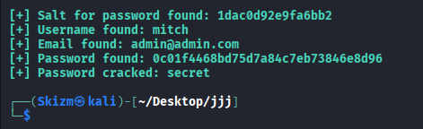
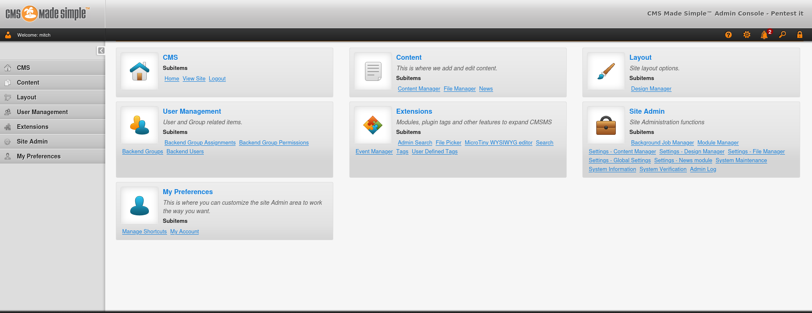

# 📅 Day 23 - 12/03/2025

## 🕣 08:23 AM - Nmap

**Platform:** [YouTube](https://www.youtube.com/watch?v=qTaOZrDnMzQ), [Heuristica](https://www.heuristi.ca/tools/free-ai-quiz-generator)

**What I Learned:**

- Rules of Engagement
- Network Verification
- Layer 2 Host Discovery
- IP List Creation
- Layer 3 Host Discovery
- Layer 4 Host Discovery
- Port States
- Default Nmap Scans
- Specific Port Scan
- Filtered Port Scan
- UDP Port Scan
- Service and Version Enumeration Scan
- Operating System Discovery Scan
- Detection Avoidance
  - Timing of Scans
  - Decoy Scan
  - Random Host Scan
  - Spoofing Mac Address
  - Fragmented Scan
- SMB Vulnerability Scan
- FTP Vulnerabilty Scan
- VULN Vulnerability Scan
- Metasploit Vulnerability Exploitation

**Notes:**

- Good Morning! Day 23 and almost a month now, will get right back on track with the next video titled [Penetration Testing with Nmap: A Comprehensive Tutorial](https://youtu.be/wlqUO09J-nw). As usual, VMware open and Heurestica after the video for the quizzes.

- That is one long video, even longer cause I was waiting for the scans to finish on my own VMWare. I doubt Heurestica can generate good questions from this video, since the content was more visual rather than auditory, but will still give it a try

- To my surprise, it actually generated great questionsm, but I still got 8/9 on the quiz. Also, that will be the end of the day, I still have one more video in store for this step of the roadmap, which I will be watching tomorrow. Getting closer and closer to my goal, so excited! BYEBYE!

### 🕙 10:00 AM - Day End

## 📅 Day 24 - 12/04/2025

### 🕣 08:23 AM - Vulnversity

**Platform:** [TryHackMe Vulnversity](https://tryhackme.com/room/vulnversity)

**What I Learned:**

- Reconnaissance
- Locating Directories with GoBuster
- Compromise the Web Server
- Privilege Escalation

**Notes:**

- Hey hey hey! Another day, another grindin'. Started the exact time I started yesterday, which is a crazy coincidence.

- So, yesterday I said I got one more video to watch, but turns out it's a very long video of a Wireshark course, like 4 hours-ish and it covers many things more advanced than the simple fundamentalsm, which I think is irrelevant right now, since I will only be learning the fundamentals of the tools.

- I will be watching it at a later time in this roadmap, but not today! SO will mark this step as completed in the tracker and move on to the next one.

- OK, so very very good step of the roadmap now called `Do beginner labs on TryHackMe / HackTheBox` so excitingg, though I doubt I'm gonna complete one lab all by myself without any help LOL.

- Will start searching for Beginner Labs on TryHackMe, hopefully most of them are free! Found this room called [Vulnversity](https://tryhackme.com/room/vulnversity) and in that it requires me to join the [OpenVPN](https://tryhackme.com/room/openvpn) room first to know how to connect to the boxes. So, will be doing that first.

- Ok the connection should be all goods now, will now take the Vulnversity room!

- Holy Shit, that was annoying and painful af! I got really mad at Step 5 where I needed to connect to the shell a lot of times cause I keep pressing Ctrl+C cause I needed to go out text editing in the victim host and it ends up also exiting the remote shell. IDFK how to counter this and hopefully, I will learn this down the road. It has been too long in this session, so I will be ending it here now! GoodBye!!!!

## 📅 Day 25 - 12/05/2025

### 🕣 08:40 AM - Blue

**Platform:** [TryHackMe Blue](https://tryhackme.com/room/blue)

**What I Learned:**

- Nmap Recon and Vuln Searching
- Hands-On Metasploit Exploits
- Privilege Escalation Using Meterpreter
- Password Hash Cracking Using JohnTheRipper and HashCat
- Browsing Windows using Command Lines to Find Flags

**Notes:**

- Good morning! I'm back. Today, I'll be continuing more beginner labs on TryHackMe. The machine today will be [Blue](https://tryhackme.com/room/blue), wish me luck!

- Ok, this is taking a while. I'm having a problem connecting the exploit to the VMWare, it's the correct exploit and all, the instructions also states that `If this failed, you may have to reboot the target VM. Try running it again before a reboot of the target.` I already rebooted the VM twice and still no luck, maybe I'm doing something wrong?

- So, I forgot to set my LHOST in the metasploit settings, silly me :P. Hopefully that does the trick. The server keeps going out, not sure if the connection problem is on my end or the servers.

- Finally got the remote shell working, that took too long LOL. AAAND I AM DONE, this was way easier than the first one. Just had to search to crack some passwords and other stuff. But I took way longer than expected, this was supoosed to be a 30min machine smh.

- All is good though, learned some pretty good stuff. Will be ending it at this time. CYA TMRW!

### 🕥 10:24 AM - Day End

## 📅 Day 26 - 12/06/2025

### 🕣 08:42 AM - Pickle Rick

**Platform:** [TryHackMe Pickle Rick](https://tryhackme.com/room/picklerick)

**What I Learned:**

- Notes Hidden in Page Source
- Directory Busting with FUZZ
- Bypassing Command Bans by Using Other Commands

**Notes:**

- Heya, good morning! Today, I'll be doing more labs, this time I'll be doing [Pickle Rick](https://tryhackme.com/room/picklerick). It's a Rick & Morty-themed CTF, if that wasn't obvious by the title lol, I hope it's not too hard. Will start now.

- AANd I am done, that took `1 hour and 26 minutes`. But I'm not proud, I had to consult Gemini for hints and I don't like it. Although, I learned more interesting things too! That's it for today, CYA TMRW!

### 🕙 10:11 AM - Day End

## 📅 Day 27 - 12/07/2025

### 🕤 09:32 AM - Lazy Admin

**Platform:** [TryHackMe Lazy Admin](https://tryhackme.com/room/lazyadmin)

**Notes:**

- Good Day! Starting out a little later today, 'cause I got busy watching YouTube, lol. So, today I will be hacking another box, this one is called [Lazy Admin](https://tryhackme.com/room/lazyadmin). Again, best of luck to me.

- Ok, it's been 1 hour and 32 minutes and I haven't gained access yet. I tried brutefourcing the ssh, but yielded no results. Found a /content page on the website and I will be looking more into this after I take a break/sleep.

- It has been 3 hours and 51 minutes, I didn't take a break. I investivated the `/content` page and found out a login page, searched the files for the password and cracked it. Gained access to the login page and ran a reverse shell via file upload. Got access and got the user flag, but the priv esc is where I had the problem. I tried everything and couldn't progress. I had no choice but to look up the walkthrough smh. Now, finally gained access to the root shell and will find the flag.

- Finally finished the machine, THIS WAS NOT A BEGINNER MACHINE! WHAT THE HELL! THIS WAS HARD AS FUCKKKKK! Anyways, that's all for today. I am hungry and sleepy to put `What I Learned section` so. just CYA TMRW!

### 🕜 01:40 PM - Day End

## 📅 Day 28 - 12/08/2025

### 🕒 03:11 AM - Simple CTF

**Platform:** [TryHackMe Simple CTF](https://tryhackme.com/room/easyctf)

**Notes:**

- Good Day! Another day today and it's the weekend, yipee! Gonna be doing more TryHackMe Boxes, this one is called [Simple CTF](https://tryhackme.com/room/easyctf). Straight to it then!

- So, first steps is scanning the server, it revealed 3 open ports: `ftp, http, ssh` Checked the ssh and ftp versions and none of them seems vulnerable. Went into the website and used ffuf to search for directories and found `/simple` and a robots.txt file which does not help at this point (maybe later?). Turns out the CMS version is vulnerable, exploit running right now and also found the login page.

-  Cracked the password and found the user, which successfully got me into the admin page  will look for a file upload of sorts and exploit it to get a reverse shell.

- Site was blocking .php uploads, used Burp Suite to figure out what extension can be uploaded. It uploaded `.phtml` extension and will activate it by opening it in the uploads folder, which I found earlier when FUZZING. Succesfully gained access to the www-data shell and will now look for flags and escalate privileges. I don't see anything that can help me as www-data, but there was an ssh port, will try to use the creds there.

- It worked! I am now logged in as mitch, will try to look for the flags here and escalate privilege. Got the user flag, succesfully escalated via vim and now I got the root flag too! Holy shit, I am very proud of myself. I didn't need any help from AI today, did it all by myself! With that, that will be the end of this session, maybe I'll continue later. CYA!

### 🕟 04:35 AM - Break

### 🕣 08:25 AM - Wgel CTF

**Platform:** [TryHackMe Wgel CTF](https://tryhackme.com/room/wgelctf)

**Notes:**

- Good Day! I am back from a break, so I wanted to do more beginner labs on TryHackMe before moving onto HackTheBox, `cause I was having fun with the last one lol. This machine is called [Wgel CTF](https://tryhackme.com/room/wgelctf). I hope I don't have to use AI for this machine.

- So, scanning with Nmap gives me 2 open ports `ssh and http`, will try connecting to the ssh first and maybe blank creds works. Ok, so it didn't, will move onto browsing the webpage for vulnerabilities. Gonna use FUZZ to brute force directories.

- Found a `/sitemap` directory, which is a `unapp` webpage, haven't found anything on the main page yet, will try to run more directory busting in the background while browsing the site.

- Found a `/sitemap/.ssh` file containing RSA private key which I assume would be the key to the ssh login? If it is, this would be my first time accessing a machine via ssh. So, now I just need the username, which should be somewhere on the site. Searched for what an RSA keys and turns out I need to decrypt it first with a tool named ssh2john. Will try that.

- It doesn't contain any passwords, interesting. So, all I really need is the username, tried `root, admin, www-data`, no luck. Maybe there's a tool to brute force usernames with an RSA file attached?

- So, I completely missed this on the first browse, but there are lists of people on the website. Will try their names as the usernames one by one and see which sticks!

- None worked, tried every combination, NOTHING! Well, gonna re-explore the site again, hopefully I find something. OH MY FUCKING GOD IT WAS AT THE SOURCE CODE FOR THE FIRST PAGE. I got so distracted by it being the default apache page and didn't check it at first. I'm such a fool, but anyways, I gained access now, time to capture some flags and escalate perms.

- Ok, so I had no prior knowledge of any of the techniques used in this root escalation. I had to use `sudo wget` to get the shadow file and upload it to my attacker machine, which was listening via `ncat`. I then had to generate a new hash for a password, in which I replaced the user's hash in the shadow file. After that, I set up a `http.server` on my machine and used `sudo wget` in the target machine to get the modified shadow file, then I outputted it into the original `/etc/shadow` file.

- I had to read a walkthrough about this, `cause I would've been stuck forever without it. But anyways, got the root access now and the flags and will be ending the day here. CYA TMRW!

### 🕙 10:10 AM - Day End

## 📅 Day 29 - 12/08/2025

### 🕣 08:36 PM - Cheese CTF

**Platform:** [TryHackMe Cheese CTF](https://tryhackme.com/room/cheesectfv10)

**Notes:**

- Good Eve! Another session here, I want to document the steps I took here with their respective screenshots, but due to the constant flickering and flashing of the screeem, I don't think I can do that. The flickering is disruptive and I would like to minimize movement of the stuff on the display, so that I can actually see something. However, when I get a monitor for my laptop, I will document my steps in hacking a box.

- So with that out of the way, today I will be hacking another box from TryHackMe. This one is called [Cheese CTF](https://tryhackme.com/room/cheesectfv10). Will get right into it!

- Starting the machine now, it says we need to give 5-7 minutes to boot, so I'll let it boot for a while first. 5 minutes done, will now start penetration.

- Nmap is taking a while to scan, ~15 minutes, while that scans, I will lay back and watch some videos! Holy moly, this is taking too long. I think it's because I used Script Scan. Will scan again and just use version scan to scan the address, this is 25 minutes later btw 😭

- Ok, finally completed the scan. Nmap revealed... A LOT OF OPEN PORTS HOLY SHIT, so that's why it was taking so long! I don't know where to start. I'll try a the port 80 webpage first and see what I can find.

- Found a login page, but no credentials yet... will use FUZZ to scout some hidden directories. My VMware crashed... my system can't handle all the stuff at once LOL. Will try adding more resources so it will not lag.

- Booted back up and crashed again, ffffuckkkk! Gonna reboot again... Ok doing good so far, running the FUZZing gives me `/messages.html` which shows a php file that can get files from the server. Used that to get the `/etc/passwd` file!

- I am stuck, I got the users but no passwords yet. Haven't gained access to the machine too. Might have to get help from a walkthrough again.

- Read the first parts of the walkthrough and I did the steps correctly before. But now I have to learn LFI to RCE, which I will continue later. I am tired at this point, so will take a break and come back! CYA!

### 🕦 11:25 PM - Break

## 📅 12/09/2025

### 🕒 03:04 AM - Cheese CTF

**Notes:**

- So, I'm back after a break. My VMware keeps crashing, which I will try to fix, 'cause it's so annoying doing everything over again. For now, I will learn the LFI to RCE using php tricks and finally gain access to the machine.

- I managed to exploit the LFI using a `php://filter` vulnerability. I used a tool called `php fiter chain generator` which I got from GitHub, I used tested it using a `id` command first and It works! Now to figure out how to reverse shell this.

- I was stupid and generated the chain for the whole php reverse shell, my bad! I was only supposed to use a specific command and I did it the harder way. The text was so long it made my VMWare crash again XD, all my fault...

- Finally gained access to the shell, after a whole lot of time, `cause while I was tryna fix my Virtual Machine, I fuckin' broke it 😭. Now, I can't use shared clipboard. But anyways, time to find the user flag.

- So found the user flag but couldn't access it sooo I read a walkthrough, read it [right here](https://medium.com/@fardinzindran/cheese-ctf-tryhackme-walkthrough-a029ff082904) for the steps. Followed the exact way and got access to the user and user flag.

- After 3 hours and 28 minutes, I finally got the root flag and that marks the machine as completed, it was exhausting, even with the walkthrough, I got no idea what to do and it only made sense after i did it. I thought I was supposed to get root shell, but instead I just had to read the file as root. That drained my time, anyways that's all done. CYA TMRW!

### 🕡 06:36 AM - Day End
